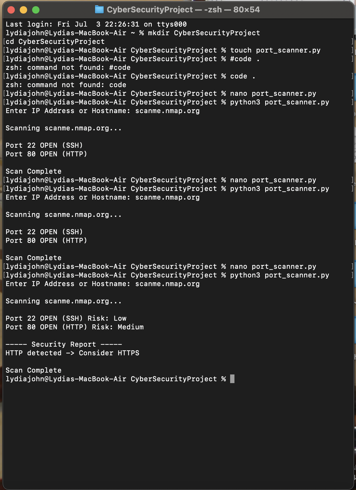

# Python Network Security Scanner

## Overview

A Python-based cybersecurity tool designed to perform basic network reconnaissance and security assessment.

## Features

- Port Scanning
- Service Detection
- Risk Classification
- Security Recommendations

## Technologies Used

- Python 3
- Socket Programming

## How It Works

The tool scans common network ports and identifies active services running on a target host.

Example:

Port 22 OPEN (SSH) Risk: Low

Port 80 OPEN (HTTP) Risk: Medium

----- Security Report -----

HTTP detected -> Consider HTTPS

## Skills Demonstrated

- Network Security
- Cybersecurity Fundamentals
- Reconnaissance
- Port Scanning
- Python Programming

## Author

Lydia Lino John
## Project Demonstration

